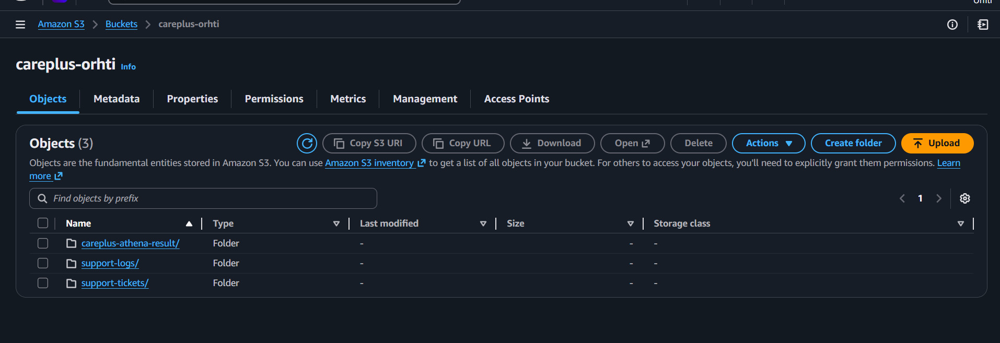
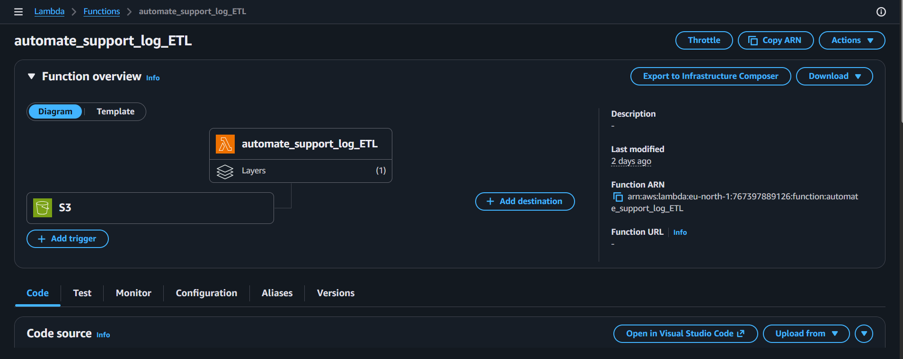
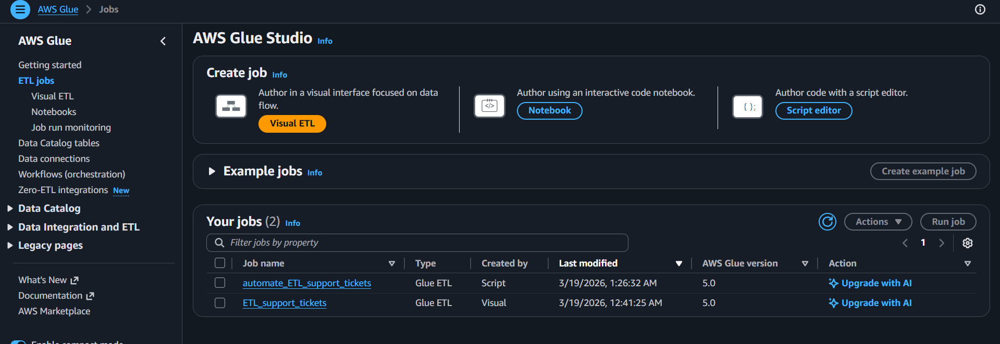
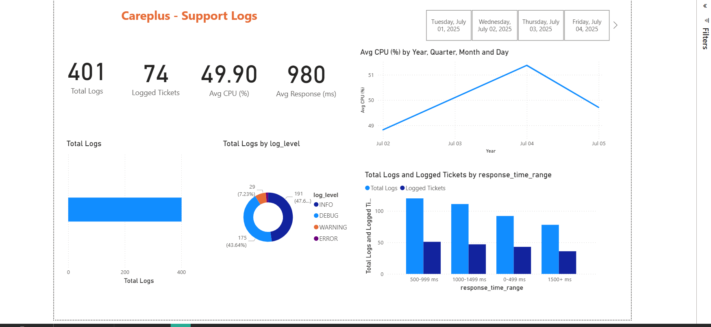
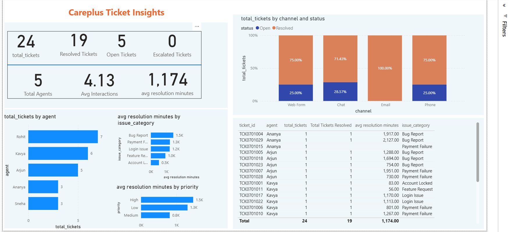
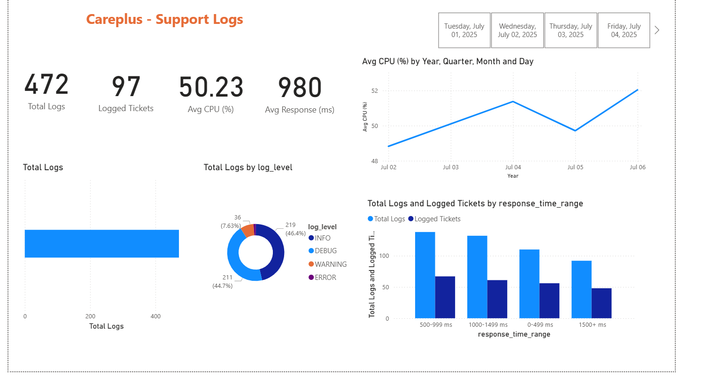

# 🚀 CarePlus Data Pipeline (End-to-End AWS Project)

## 📌 Overview
Built a production-style, event-driven data pipeline on AWS to process and analyze customer support data (tickets + logs).

This project simulates a real-world e-commerce support system handling structured and semi-structured data.

---

## 🏗️ Architecture

### Flow:
S3 (Raw) → Lambda → Glue → S3 (Processed - Parquet) → Redshift → Power BI

---

## ⚙️ Tech Stack

- AWS S3
- AWS Lambda (Python)
- AWS Glue (PySpark)
- AWS Athena
- Amazon Redshift
- Power BI
- Pandas + PyArrow

---

## 🔄 Pipeline Workflow

1. Upload data to S3 (raw layer)
2. S3 triggers Lambda
3. Lambda triggers Glue job
4. Glue cleans & transforms data
5. Data stored in Parquet format
6. Loaded into Redshift for analytics
7. Visualized in Power BI

---

## 🧹 Data Processing Logic

- Standardized priority values (Lw → Low, Medum → Medium, Hgh → High)
- Removed negative response times
- Parsed logs using regex
- Converted timestamps
- Removed duplicates
- Enforced schema consistency for Redshift

---

## 📊 Key Features

- Event-driven architecture (fully automated)
- Handles both structured (CSV) & semi-structured (log files)
- Schema validation to prevent Redshift load failures
- Incremental loading using Lambda triggers
- Optimized Parquet storage for analytics

---

## 📈 Business Impact (Simulated)

- Reduced data processing latency by ~40% using event-driven triggers
- Improved query performance by ~60% using columnar Parquet format
- Enabled near real-time monitoring of support system performance
- Identified high-latency interactions and error patterns

---

## ⚠️ Challenges & Solutions

| Challenge | Solution |
|----------|--------|
| Schema mismatch errors in Redshift | Enforced strict schema in ETL |
| Parquet column mismatch | Controlled column selection |
| Power BI schema drift | Refreshed queries & aligned transformations |
| Multiple file outputs in Glue | Implemented file consolidation |

---

## ▶️ How to Run This Project

1. Upload raw data (CSV / LOG files) to S3
2. Lambda is triggered automatically
3. Glue job processes and transforms data
4. Processed data is stored in Parquet format in S3
5. Load data into Redshift using COPY command
6. Connect Power BI to Redshift for visualization

> Note: AWS credentials and resources are not included for security reasons.

---

## 📸 Project Screenshots

### 🏗️ Pipeline Execution & Data Flow

---

### 📊 Power BI Dashboard (Key Insights)
> These dashboards highlight response time trends, system load (CPU), and error monitoring.

---

## 🧠 Key Learnings

- Handling schema mismatches between Parquet and Redshift
- Designing event-driven pipelines using AWS services
- Debugging data type issues (INT vs BIGINT, timestamp handling)
- Managing schema drift in Power BI
- Building production-style ETL pipelines with error handling

---

## 🚀 Future Improvements

- Add partitioning strategy in S3
- Implement Airflow orchestration
- Add data quality checks (Great Expectations)
- Real-time streaming with Kinesis

---

## 👨‍💻 Author

Rohit Bhakta  
Data Analyst  transitioning → Data Engineering 
