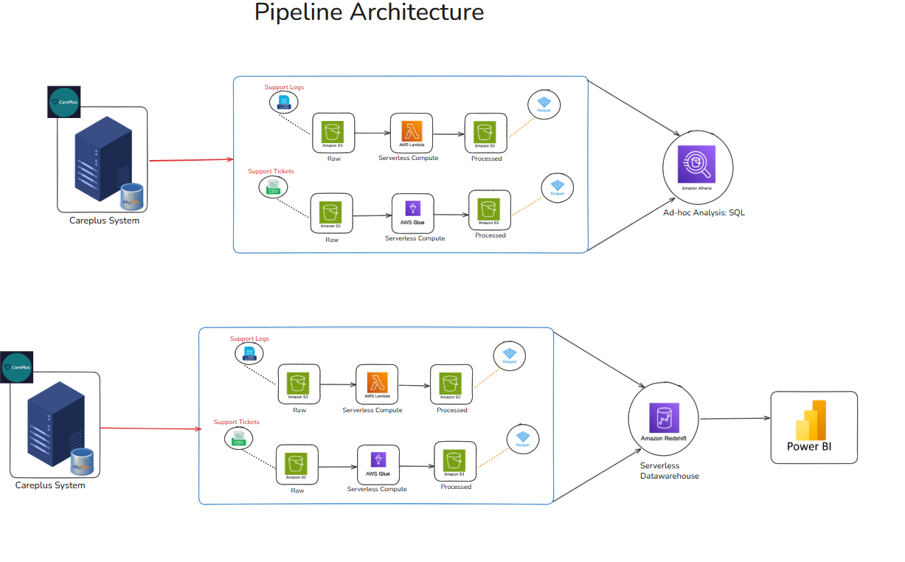

# 🚀 CarePlus Data Pipeline (End-to-End AWS Project)

## 📌 Overview
Built a production-style, event-driven data pipeline on AWS to process and analyze customer support data (tickets + logs).

This project simulates a real-world e-commerce support system handling structured and semi-structured data.

---

## 🏗️ Architecture

### Flow:
S3 (Raw) → Lambda → Glue → S3 (Processed - Parquet) → Redshift → Power BI

---

## ⚙️ Tech Stack

- AWS S3
- AWS Lambda (Python)
- AWS Glue (PySpark)
- AWS Athena
- Amazon Redshift
- Power BI
- Pandas + PyArrow

---

## 🔄 Pipeline Workflow

1. Upload data to S3 (raw layer)
2. S3 triggers Lambda
3. Lambda triggers Glue job
4. Glue cleans & transforms data
5. Data stored in Parquet format
6. Loaded into Redshift for analytics
7. Visualized in Power BI

---

## 🧹 Data Processing Logic

- Standardized priority values (Lw → Low, etc.)
- Removed negative response times
- Parsed logs using regex
- Converted timestamps
- Removed duplicates
- Enforced schema consistency for Redshift

---

## 📊 Key Features

- Event-driven architecture (fully automated)
- Handles both structured (CSV) & semi-structured (logs)
- Schema validation to prevent Redshift load failures
- Incremental loading using Lambda triggers
- Optimized Parquet storage for analytics

---

## 📈 Business Impact (Simulated)

- Reduced data processing latency by ~40% using event-driven triggers
- Improved query performance by ~60% using columnar Parquet format
- Enabled real-time monitoring of support system performance
- Identified high-latency interactions and error patterns

---

## ⚠️ Challenges & Solutions

| Challenge | Solution |
|----------|--------|
| Schema mismatch errors in Redshift | Enforced strict schema in ETL |
| Parquet column mismatch | Controlled column selection |
| Power BI schema drift | Refreshed queries & aligned transformations |
| Multiple file outputs in Glue | Implemented file consolidation |

---

## 🚀 Future Improvements

- Add partitioning strategy in S3
- Implement Airflow orchestration
- Add data quality checks (Great Expectations)
- Real-time streaming with Kinesis

---

## 👨‍💻 Author

Rohit Bhakta  
Data Analyst
